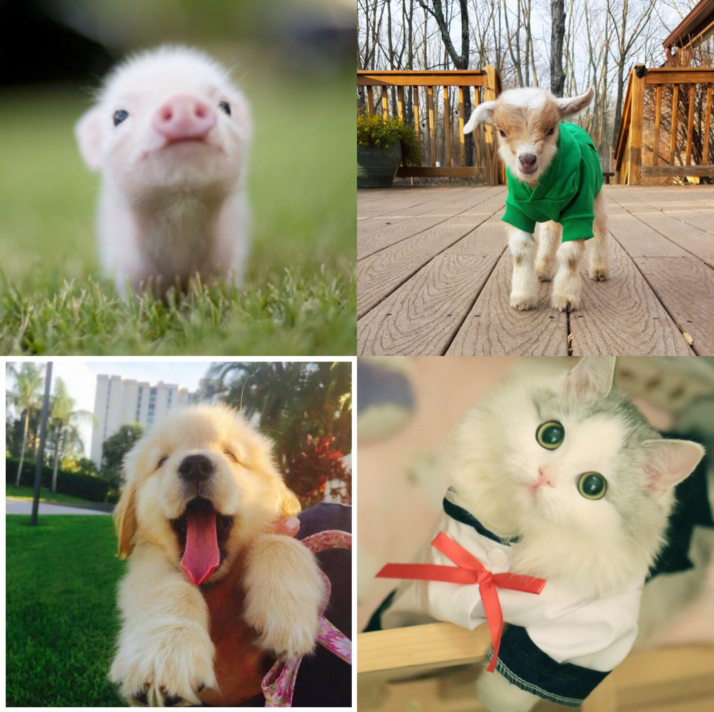

# Seattle Pet licenses

This repository is for the Info 201 final project.

Using the City of Seattle's data, we compiled information around pets licensed in Seattle neighborhoods over 16 years. The data includes, _what date the license was issued, names of animals, their species, what the breed is and the zip code they live in._ 

We created an interactive platform using Shiny that informed our users about common pet names and total number of pets registered in Seattle. We used a line graph with animations to show the _trajectory of animals being licensed over the years_. To see the _population density of each area_ we used ggplot, this will help pet store owners know which areas are best to open up pet shops, and also will give City of Seattle employees information about unregistered pets in specific areas like downtown and South Seattle. With this information they will be able to increase the number of pets licensed in those areas and provide better outreach. Our last tab is a word wall of _the most common names_ for each species (Dogs, Cats, Goats and Pigs). Using the word cloud package in shiny, we provide our users with the names pets already have in Seattle. For example, looking for a name for your new pet goat? If you look at our world wall, you can easily find a common name like “Brussel Sprouts” and choose to use it or avoid it completely. 

The overall goal was to provide users information about pets in Seattle and our shiny app does a great job of providing that information. If you are a new pet owner, own a pet shop or are a City of Seattle employee, check out our app and get the information you need to make the import decisions for your new pet or learn pet license logistics in the Seattle area.

Dataset: https://data.seattle.gov/Community/Seattle-Pet-Licenses/jguv-t9rb

Shiny app: https://daili6465.shinyapps.io/404notfound/ (Note: the app might take a while to generate plots. Thanks for your patience!)

